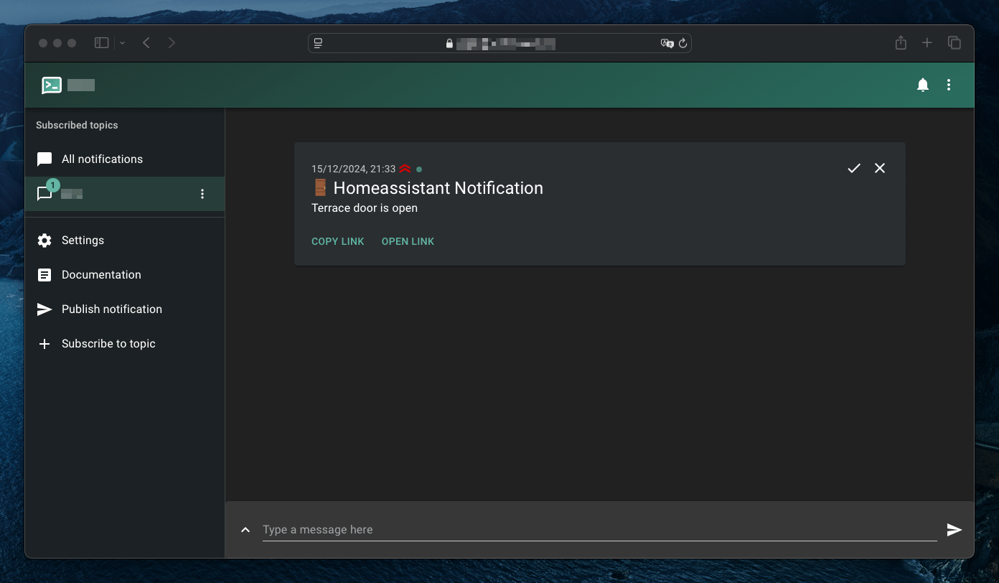
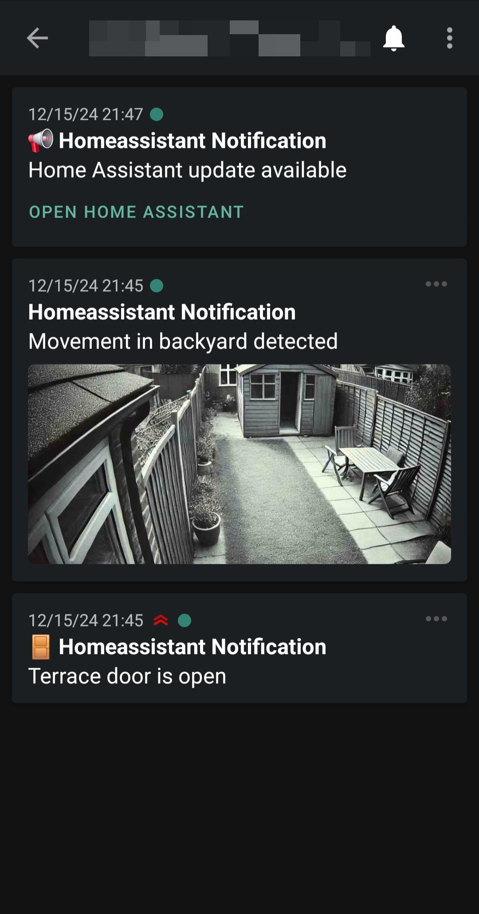

# Homeassistant Integration: Notify via ntfy.sh / selfhosted ntfy-server
[](https://github.com/hbrennhaeuser/homeassistant_integration_ntfy/releases/latest) [](https://github.com/hacs/integration)  

This custom component allows you to send notifications through [ntfy.sh](https://ntfy.sh/) or selfhosted ntfy-servers.
Authentication, tags, image- and file-attachments, click, url and action-buttons are supported.

<p>
  
  
</p>

> :warning: **Warning**: The `main` branch is under active development and may not be stable. For the latest stable release, please refer to the [v1.0.2 release](https://github.com/hbrennhaeuser/homeassistant_integration_ntfy/releases/tag/v1.0.2) and the [v1.0.2 branch/tag](https://github.com/hbrennhaeuser/homeassistant_integration_ntfy/tree/v1.0.2).

## Installation

The recommended way to install this integration is through HACS.

### HACS

Add this repository as a custom repository in hacs (category: integration).
When the custom repository is added you can search for and install this integration.

Make sure to restart Homeassistant after the installation.

### Manual

Copy custom_components/ntfy to config/custom_components/ntfy.

Make sure to restart Homeassistant after the installation.

## Configuration

Define a new ntfy notification-service in configuration.yaml:

Example:

```yaml
notify:
    - name: ntfy_notification
      platform: ntfy
      authentication: 'token'
      #username: 'user' 
      #password: 'password' 
      token: 'tk_odlbse211n74kf8N7h4qhqvj409qb'
      topic: 'mytopic'
      url: 'https://ntfy.domain.tld' 
      #verify_ssl: True 
      allow_topic_override: True
      #attachment_maxsize: 300K
```

Options:

| Option | Required | Default value | Values | Description |
| --- | --- | --- | --- | --- |
|authentication|No|False|user-pass/token/False|Specify authentication-type to use. Set to False to connect to the server anonymously.|
|username|If authentication is 'user-pass'||username|ntfy username|
|password|If authentication is 'user-pass'||password|ntfy password|
|token|If authentication is 'token'||token|ntfy authentication token|
|topic|No||topic|Topic to publish to. It's recommended to set the topic here, but you can also set it in each notification-call if allow_topic_override is True.|
|url|Yes||url|ntfy-instance-url, example: https://ntfy.domain.tld|
|verify_ssl|No|True|True/False|Specifies if the certificate of the ntfy-server should be verified. Set to False for self-signed certificates.|
|allow_topic_override|No|False|True/False|Allow topic-override in each notification-call.|
|attachment_maxsize|No|15M|filesize, allowed Units B/K/M, default=B, factor=1024 |Set max size for file-attachments. This should match or be below the settings of the ntfy-server. Currently the file-size is checked before any compression is applied. Keep in mind the file is loaded into memory before sending when setting this value.|

## Usage

Call the notification service anywhere in Homeassistant:

Minimal call:

```yaml
action: notify.ntfy_notification
data:
  message: Terrace door is open
```

| Option | Required | Default value | Values | Description |
| --- | --- | --- | --- | --- |
|title|No|||Notification title|
|message|Yes|||Notification message|
|data/tags|No|||Message tags|
|data/priority|No|||Message priority|
|data/click|No||url|URL to open when the notification is clicked|
|data/topic|No||topic|Override the default topic if allow_topic_override is True|
|data/attach_url|No||url|URL to file/image|
|data/attach_file|No||file-path|Path to local file|
|data/attachment_filename|No||filename|Filename. If compression is active, this applies to the final compressed file.|
|data/attachment_compress_image|No||int<0-100>|[Only applies to attach_file] Convert image to JPEG. Value is the JPEG-quality|
|data/attachment_compress_file|No||int<0-9>|[Only applies to attach_file] Compress file to zip using zlib. Value is the zlib-compression-level|
|data/attachment_resize_image|No||int%/intpx|[Only applies to attach_file] Resize image (and convert to jpeg). Value is either in percent (25%) or px (800px). When using px, you specify the new image width, the height is calculated using the original aspect-ratio.|
|actions/[]|No||view/broadcast/http||
|actions/[]/action|Yes||view/broadcast/http||
|actions/[]/label|Yes||view/broadcast/http||
|actions/[]/clear|No|false|true/false||
|actions/[]view/url|Yes||url|URL to open on button-click|


Please refer to the [ntfy documentation](https://docs.ntfy.sh/publish) for more information about those features.

## Usage examples

> [!NOTE]  
> As of 2025/05 many advanced features like attached images and action-buttons are not available on the IOS-App.

Set a title, tags, message-priority, add a click-action and override the default topic:

```yaml
action: notify.ntfy_notification
data:
  title: Home Assistant Notification
  message: Terrace door is open
  data:
    tags: door
    priority: high
    click: https://myhomassistant.domain.tld
    topic: myothertopic
```

Attach a local file (image), compress it and override the filename:

```yaml
action: notify.ntfy_notification
data:
  title: Home Assistant Notification
  message: Movement in backyard detected
  data:
    attach_file: /media/local/cam0_latest_detection.png
    attachment_compress_image: 25
    attachment_filename: detection.jpg
```

Add view-action-button

```yaml
action: notify.ntfy_notification
data:
  title: Homeassistant Notification
  message: Movement in backyard detected
  data:
    actions:
      - action: view
        label: "Open Home Assistant"
        url: "https://myhomassistant.domain.tld"
```

Interact with homeassistant through view-action-buttons

```yaml
action: notify.ntfy_notification
data:
  title: Homeassistant Notification
  message: Lights in living room turned off
  data:
    actions:
      - action: http
        label: Turn lights on
        method: POST
        url: https://https-address-of-ha/api/services/light/turn_on
        headers:
          Authorization: >-
            Bearer 1234567890abcde...
          Content-type: application/json
        body: "{\"entity_id\": \"light.living_room_lights\"}"
```